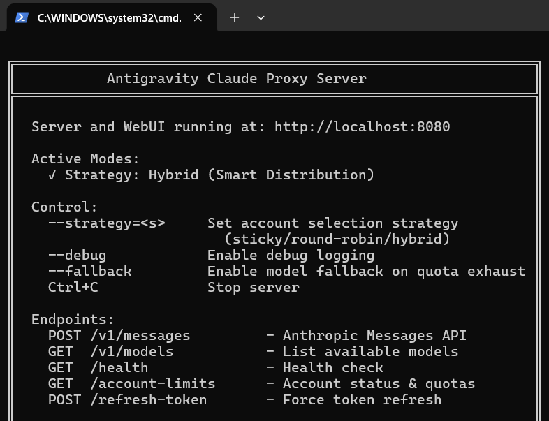
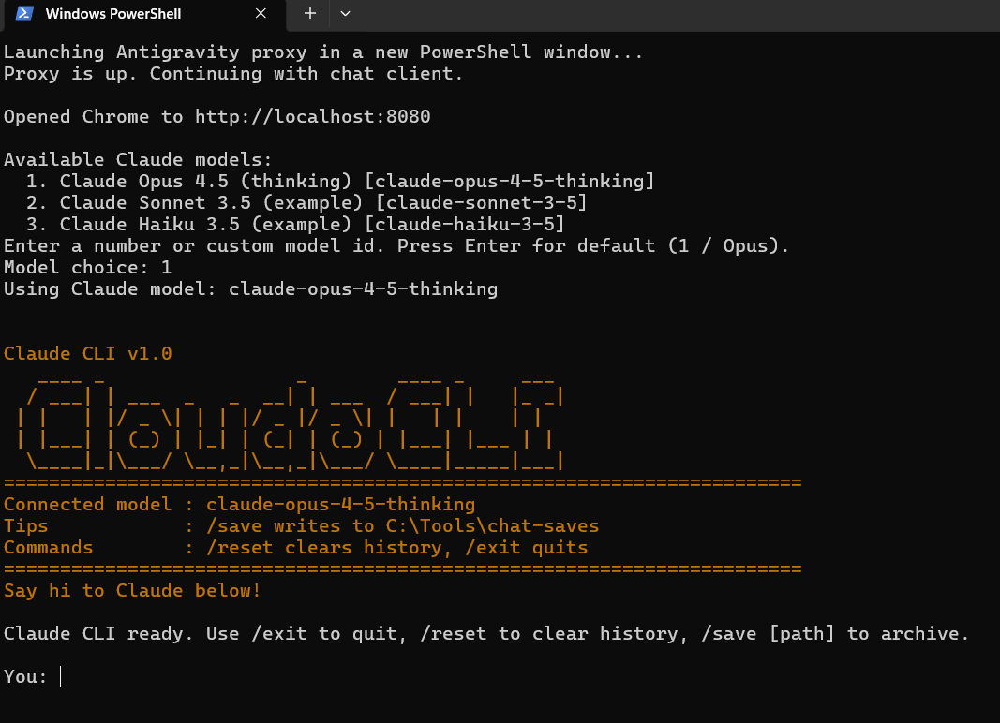
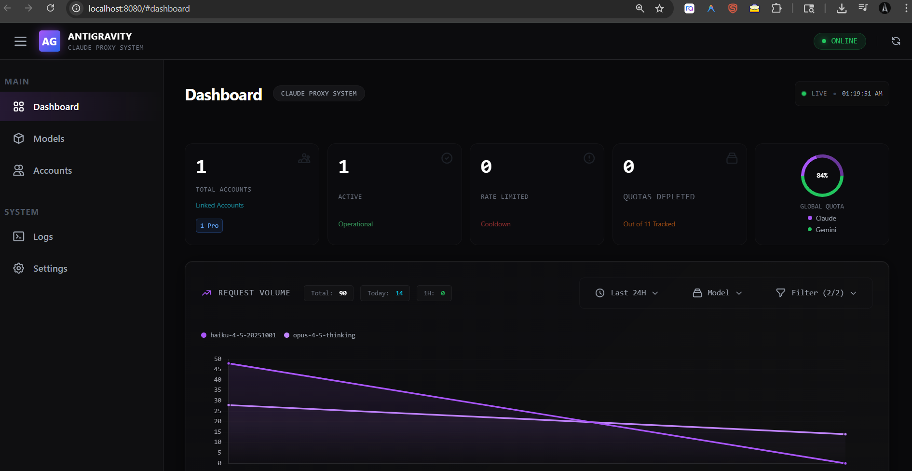

# Claude CLI (PowerShell) — Antigravity Proxy Client

A **single‑file** interactive PowerShell chat client for Claude that talks to a local **Antigravity Claude Proxy** via the Anthropic‑compatible **`/v1/messages`** API.

You do **not** need to clone this repository or install it as a package. Downloading the `.ps1` file is enough.

---

## Features
- Single PowerShell script (no build step)
- Interactive chat loop
- Model picker (default: `claude-opus-4-5-thinking`)
- Conversation memory across turns
- Built‑in commands:
  - `/exit` — quit
  - `/reset` — clear conversation history
  - `/save [path]` — save transcript
- Optional convenience behavior:
  - Automatically starts the Antigravity proxy via `npx` if not running
  - Opens the proxy dashboard (`http://localhost:8080`) in your browser

---

## Requirements
- Windows
- PowerShell 5.1+ or PowerShell 7+
- Node.js (only required so `npx` can start the proxy)
- **Access to Antigravity Claude Proxy**  
  (The script can start it automatically if not already running)

---

## How This Works (One-Minute Overview)

This CLI does **not** connect directly to Anthropic.

Instead, it talks to a **local Antigravity Claude Proxy** running on your machine:

---

## Quick Start (No Git Clone Required)

### Step 1 — Download the Script

Download `claude-cli.ps1` from:
- This repository, or
- The latest GitHub Release

You do **not** need to clone the repository.

---

### Step 2 — Allow PowerShell Script Execution (One-Time)

Open PowerShell and run:

```powershell
Set-ExecutionPolicy -Scope CurrentUser RemoteSigned
```

---

### Step 3 — Run the CLI

Open PowerShell in the directory containing `claude-cli.ps1` and run:

```powershell
powershell -ExecutionPolicy Bypass -File .\claude-cli.ps1
```

---

### Step 4 — Run Behavior (Important)

On the **run**, **two PowerShell windows will open**:

1. **Claude CLI Window**  
   This is the interactive chat interface you will use.

2. **Antigravity Proxy Server Window**  
   This runs the local proxy server that connects the CLI to Claude.

This behavior is **normal and expected**.

---

### Step 5 — Authenticate with Antigravity (One-Time Setup)

When the proxy starts, your browser may open automatically at:

```
http://localhost:8080
```

If it does not open automatically, open it manually.

In the browser:
1. Navigate to **Accounts**
2. Sign in using your **Google account**

Authentication is required before Claude models can be used.

---

### Step 6 — Restart After Login (Required)

After signing in successfully:

1. Press **CTRL + C** in **both PowerShell windows**:
   - Claude CLI window
   - Antigravity Proxy Server window
2. Close both windows
3. Re-run the script:

```powershell
powershell -ExecutionPolicy Bypass -File .\claude-cli.ps1
```

---

### Step 7 — Start Chatting with Claude

After restarting:
- The proxy will reuse your authenticated session
- The CLI will connect automatically
- You can now chat with **Claude Opus**

---

### Available Commands

Inside the CLI, the following commands are available:

- `/reset` — Clear conversation history
- `/save` — Save the current transcript
- `/save C:\path\to\file.txt` — Save transcript to a custom path
- `/exit` — Exit the CLI

```powershell
Set-ExecutionPolicy -Scope CurrentUser RemoteSigned
```

4. Run the script:

```powershell
powershell -ExecutionPolicy Bypass -File .\claude-cli.ps1
```

That’s it — the CLI will start and prompt you for input.

---

## What Happens on Startup

When launched, the script may:
- Check whether the Antigravity proxy is reachable on port `8080`
- Launch the proxy in a new PowerShell window if it is not running
- Open `http://localhost:8080` in your default browser
- Prompt you to select a Claude model (press Enter to use the default)

---

## Commands

Available inside the CLI:

- `/reset` — clears conversation history
- `/save` — saves the transcript to the default directory
- `/save C:\path\to\file.txt` — saves the transcript to a custom path
- `/exit` — exits the program

---

## Configuration

The script uses the following defaults:

- Endpoint: `http://localhost:8080/v1/messages`
- HTTP header: `x-api-key: local-placeholder-key`

The API key value is a **placeholder** and is ignored by the local proxy. No real API keys are required by default.

---

## Safety and Privacy Notes

- This repository contains **no real API keys, tokens, or credentials**.
- Chat transcripts may contain sensitive content. If you save transcripts locally, handle them accordingly.
- The script may open a browser window and spawn a new PowerShell process to start the proxy.

---


## Security & Privacy Review

### No secrets detected
The script does **not** include:
- API keys
- Authentication tokens
- Email addresses
- Account identifiers

### Non‑sensitive but noteworthy behavior
These are intentional and documented:
- Auto‑starting the proxy using `npx antigravity-claude-proxy@latest start`
- Opening the local dashboard at `http://localhost:8080`
- Saving transcripts to a local directory


---

## Screenshots

### Antigravity Proxy Server
The local Antigravity proxy running and ready to accept requests.



---

### Claude CLI (PowerShell)
Interactive Claude chat running via the local Antigravity proxy.



---

### Localhost Web Dashboard
The Antigravity web dashboard available at `http://localhost:8080`.



## FAQ

## Do I Need Antigravity IDE?

**No.**

You do **not** need to open or run the Antigravity IDE manually.

This script works with the **Antigravity Claude Proxy**, not the IDE UI.

If the proxy is not running, the script can automatically start it for you using `npx`.


The Antigravity proxy:
- Runs locally on your computer
- Uses an Anthropic-compatible `/v1/messages` API
- Handles authentication and rate-limiting
- Requires a one-time sign-in via your browser


### Why does a browser window open?
The Antigravity proxy runs locally and uses a browser-based login for authentication.

### Why do I need to sign in with Google?
Antigravity uses Google sign-in to manage access, quotas, and model usage.

### Do I need to sign in every time?
No. After the first successful login, the session is reused.

### Is my API key exposed?
No. This script does not store or transmit API keys.


## License

MIT License

Copyright (c) 2026 Abdur Rahman Khan

Permission is hereby granted, free of charge, to any person obtaining a copy
of this software and associated documentation files (the "Software"), to deal
in the Software without restriction, including without limitation the rights
to use, copy, modify, merge, publish, distribute, sublicense, and/or sell
copies of the Software, and to permit persons to whom the Software is
furnished to do so, subject to the following conditions:

The above copyright notice and this permission notice shall be included in all
copies or substantial portions of the Software.

THE SOFTWARE IS PROVIDED "AS IS", WITHOUT WARRANTY OF ANY KIND, EXPRESS OR
IMPLIED, INCLUDING BUT NOT LIMITED TO THE WARRANTIES OF MERCHANTABILITY,
FITNESS FOR A PARTICULAR PURPOSE AND NONINFRINGEMENT. IN NO EVENT SHALL THE
AUTHORS OR COPYRIGHT HOLDERS BE LIABLE FOR ANY CLAIM, DAMAGES OR OTHER
LIABILITY, WHETHER IN AN ACTION OF CONTRACT, TORT OR OTHERWISE, ARISING FROM,
OUT OF OR IN CONNECTION WITH THE SOFTWARE OR THE USE OR OTHER DEALINGS IN THE
SOFTWARE.
